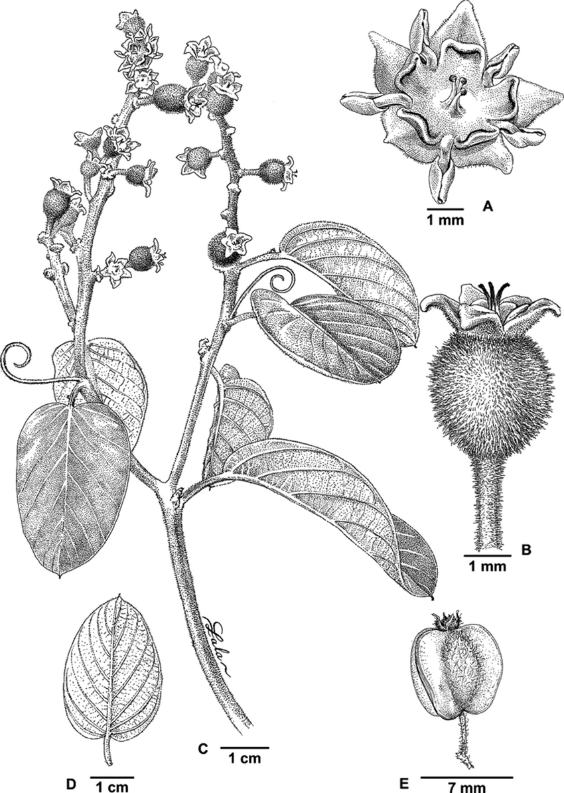
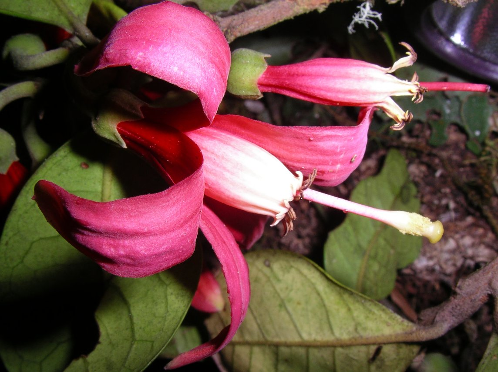
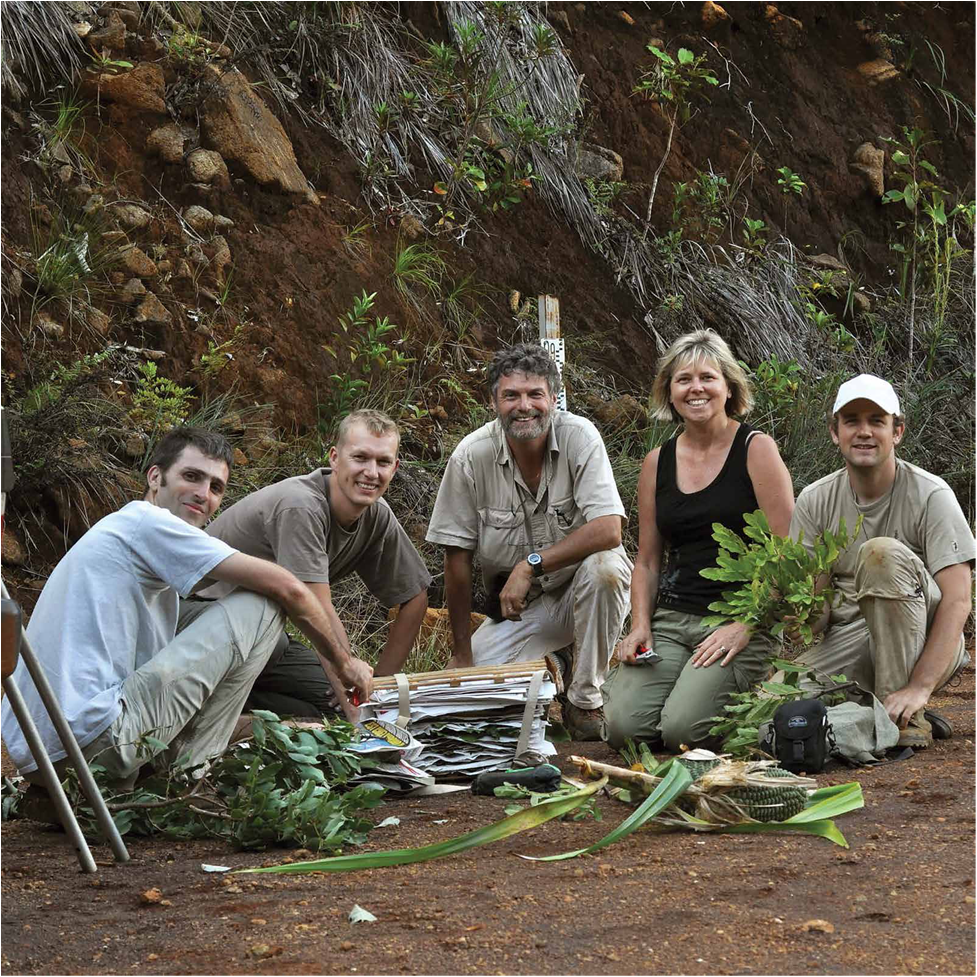

```{r, include=FALSE}
knitr::opts_chunk$set(
  results='asis', 
  echo = FALSE
)


CRANpkg <- function (pkg) {
    cran <- "https://CRAN.R-project.org/package"
    fmt <- "[%s](%s=%s)"
    sprintf(fmt, pkg, cran, pkg)
}

Biocpkg <- function (pkg) {
    sprintf("[%s](http://bioconductor.org/packages/%s)", pkg, pkg)
}

library(glue)
library(tidyverse)

# Set this to true to have links turned into footnotes at the end of the document
PDF_EXPORT <- FALSE

# Holds all the links that were inserted for placement at the end
links <- c()

find_link <- regex("
  \\[   # Grab opening square bracket
  .+?   # Find smallest internal text as possible
  \\]   # Closing square bracket
  \\(   # Opening parenthesis
  .+?   # Link text, again as small as possible
  \\)   # Closing parenthesis
  ",
  comments = TRUE)

sanitize_links <- function(text){
  if(PDF_EXPORT){
    str_extract_all(text, find_link) %>% 
      pluck(1) %>% 
      walk(function(link_from_text){
        title <- link_from_text %>% str_extract('\\[.+\\]') %>% str_remove_all('\\[|\\]') 
        link <- link_from_text %>% str_extract('\\(.+\\)') %>% str_remove_all('\\(|\\)')
        
        # add link to links array
        links <<- c(links, link)
        
        # Build replacement text
        new_text <- glue('{title}<sup>{length(links)}</sup>')
        
        # Replace text
        text <<- text %>% str_replace(fixed(link_from_text), new_text)
      })
  }
  
  text
}


# Takes a single row of dataframe corresponding to a position
# turns it into markdown, and prints the result to console.
build_position_from_df <- function(pos_df){
  
  missing_start <- pos_df$start == 'N/A'
  dates_same <- pos_df$end == pos_df$start
  if (pos_df$end == 9999) {
    pos_df$end = "present"
  }
  if(any(c(missing_start,dates_same))){
    timeline <- pos_df$end
  } else {
    timeline <- glue('{pos_df$end} - {pos_df$start}')
  }

  descriptions <- pos_df[str_detect(names(pos_df), 'description')] %>% 
    as.list() %>% 
    map_chr(sanitize_links)
  
  # Make sure we only keep filled in descriptions
  description_bullets <- paste('-', descriptions[descriptions != 'N/A'], collapse = '\n')
  
  if (length(description_bullets) == 1 && description_bullets == "- ") {
    description_bullets <- ""
  }
  glue(
"### {sanitize_links(pos_df$title)}

{pos_df$loc}

{pos_df$institution}

{timeline}

{description_bullets}


"
  ) %>% print()
}

# Takes nested position data and a given section id 
# and prints all the positions in that section to console
print_section <- function(position_data, section_id){
  x <- position_data %>% 
    filter(section == section_id) %>% 
    pull(data) 
  
  prese <- " - "
  xx <- list()

  for (i in seq_along(x)) {    
      y = x[[i]]
      y <- cbind(y, start2 = as.character(y$start))
      y <- cbind(y, end2 = as.character(y$end))

      se <- paste(y$start, "-", y$end, collapse = " ")
      if (prese == se) {
        y$start2 = ""
        y$end2 = ""
      } else {
        prese = se
      }

    xx[[i]] <- select(y, -c(start, end)) %>%
      rename(start=start2, end=end2)
  }
    
  xx %>% 
    purrr::walk(build_position_from_df)
}


fill_nas <- function(column){
  ifelse(is.na(column), 'N/A', column)
}

# Load csv with position info
position_data <- read_csv('positions.csv') %>% 
  mutate_all(fill_nas) %>% 
  arrange(order, desc(end)) %>% 
  mutate(id = 1:n()) %>% 
  nest(data = c(-id, -section))
```

```{r}
# When in export mode the little dots are unaligned, so fix that. 
if(PDF_EXPORT){
  cat("
  <style>
  :root{
    --decorator-outer-offset-left: -6.5px;
  }
  </style>")
}
```

Aside
================================================================================


{width=100%}

```{r}
# When in export mode the little dots are unaligned, so fix that. 
if(PDF_EXPORT){
  cat("View this CV online with links at _guangchuangyu.github.io/cv_")
}
```

Contact {#contact}
--------------------------------------------------------------------------------


- <i class="fa fa-envelope"></i> svenbuerki@boisestate.edu
- <i class="fa fa-github"></i> [svenbuerki](https://github.com/svenbuerki)
- **ORCID** [0000-0002-8299-6539](http://orcid.org/0000-0002-8299-6539)
- <i class="fa fa-phone"></i> +1 208-426-1146

<br>

Skills {#skills}
--------------------------------------------------------------------------------


<i class="fa fa-laptop"></i> **Programming**: R, RMarkdown, LaTeX, bash, HTML, Git, GitHub  <br>
<i class="fa fa-laptop"></i> **R package:** [G2PMineR](https://buerkilabteam.github.io/G2PMineR_Web/)  <br>
<i class="fa fa-flask"></i> **Laboratory**: Next-generation sequencing (WGS, RNAseq), Sanger, PCR, tissue culture  <br>
<i class="fa fa-lightbulb-o"></i> **Other**: GxE experiments, Reproducible Science, Taxonomy <br> 

<br>

Disclaimer {#disclaimer}
--------------------------------------------------------------------------------


Last updated on `r Sys.Date()`.


Main
================================================================================

Sven Buerki {#title}
--------------------------------------------------------------------------------

```{r, results='asis'}
intro_text <- glue("Assistant Professor, Department of Biological Sciences at Boise State University. My research interests are in the fields of genomics, evolutionary plant biology and bioinformatics. 

                   My lab applies a genome-to-phenome approach to investigate mechanisms of drought adaptations in plants and focuses on forecasting the effect of climate change on natural ecosystems. We are currently focusing our efforts on the sagebrush steppe of western North America by using *Artemisia tridentata* (or sagebrush) as model organism. This research is integrated into the [EPSCoR NSF GEM3](https://www.idahogem3.org) project. 
                   
                   Since the Fall of 2020, I am acting as co-lead for the [GEM3 Sagebrush Mechanism](https://www.idahogem3.org/organizational-chart) component of the project. I am leading a team aiming at sequencing, phasing and annotating the 9.5 Gbp diploid genome of sagebrush. More details on the Sagebrush Genome Project can be found [here](https://svenbuerki.github.io/Sagebrush_Genome_Project/).")

cat(sanitize_links(intro_text))
```

Education {data-icon=graduation-cap data-concise=true}
--------------------------------------------------------------------------------

```{r, results='asis', echo = FALSE}
print_section(position_data, 'education')
```


Research Experience {data-icon=laptop}
--------------------------------------------------------------------------------

```{r, results='asis', echo = FALSE}
print_section(position_data, 'research_positions')
```


Publications in peer-reviewed journals {data-icon=book}
--------------------------------------------------------------------------------
:::aside
<span style="text-transform:uppercase">Publication metrics</span>  

```{r, eval=T}
profile = jsonlite::fromJSON("profile.json")
cites = jsonlite::fromJSON("citation.json")
if (profile$total_cites < sum(cites$cites))
  profile$total_cites <- sum(cites$cites)

glue(

"
+ N. publications = 105 (29 as first and 33 as senior author)
+ N. publications @ BSU = 25 (6 with graduate students: #103, 101, 99, 95, 92, 89)
+ Citation = {profile$total_cites}
+ H-index = {profile$h_index}
+ I10-index = {profile$i10_index}

"
  ) %>% print()

```


:::

```{r}
print_section(position_data, 'academic_articles')
```

::: aside

```{r, eval=F}
# ggtree <- "ggtree: an R package for visualization and annotation of phylogenetic trees with their covariates and other associated data"
ggtree <- "ggtree (Yu et al. 2017)"
url <- 'http://onlinelibrary.wiley.com/doi/10.1111/2041-210X.12628/abstract'

ggtree2 <- glue("[{ggtree}]({url})")
journal <- "**_Methods in Ecology and Evolution_**"

url2 <- "https://methodsblog.com/2020/11/19/ggtree-tree-visualization/"
journal2 <- glue("[{journal}]({url2})")
  
glue(
  " 
  The {ggtree2} paper was selected as a feature article to celebrate the 10^th^ anniversary of the launch of {journal2}.
  "
) %>% print()
```


<span style="text-transform:uppercase">Plant taxonomic novelties</span>

```{r}
glue(
  " 
  + 1 family 
  + 4 genera 
  + 3 sections
  + 33 species
  + 1 new name
  + 114 comb. nov.
  "
) %>% print()
```
  
<br>
{width=100%}

:::


Publications in review {data-icon=book}
--------------------------------------------------------------------------------

```{r}
print_section(position_data, 'in_review')
```


Book chapters {data-icon=book}
--------------------------------------------------------------------------------


```{r}
print_section(position_data, 'book_chapters')
```


Other Publications {data-icon=book}
--------------------------------------------------------------------------------

::: aside

<span style="text-transform:uppercase">Eponymy</span>

<p style="text-align:justify;">As part of a botanical expedition in the Ambohimirahavavy region (Madagascar) I collected a specimen of Meliaceae, which turned out to represent a new species. My friends were very kind and dedicated this new species to me and my family: _**Turraea buerkii**_ Callm., Phillipson & Lowry, *Adansonia*, *sér.* 3, 34(1): 100. 2012.</p>
  
{width=100%}
:::


```{r}
print_section(position_data, 'other_pub')
```

Grants  {data-icon=chart-line}
--------------------------------------------------------------------------------

```{r}
print_section(position_data, 'grant')
```

Teaching Experience {data-icon=chalkboard-teacher}
--------------------------------------------------------------------------------

::: aside

<span style="text-transform:uppercase">Teaching/Lab. ethos</span>

<blockquote>
Everyone here is smart; distinguish yourself by being kind.
</blockquote>
<p> -- Kindness in Science is an inclusive approach that fosters diversity, respect, wellbeing & openness leading to better science outcomes.</p>

{width=100%}
:::


```{r, results='asis', echo = FALSE}
print_section(position_data, 'teaching_positions')
```

Graduate students {data-icon=chalkboard-teacher}
--------------------------------------------------------------------------------


```{r}
print_section(position_data, 'students')
```


Research staff {data-icon=fa-flask}
--------------------------------------------------------------------------------

::: aside

<span style="text-transform:uppercase">Fieldwork</span>

<p style="text-align:justify;">**Botanical expeditions** in Croatia, Fiji, Italy, Madagascar, Malaysia (Borneo and Peninsular Malaysia), Mauritius, New Caledonia, Singapore, Switzerland and USA.</p>

{width=100%}
:::

```{r}
print_section(position_data, 'research_staff')
```

Graduate committees
--------------------------------------------------------------------------------

```{r}
print_section(position_data, 'graduate_committee')
```

External referee
--------------------------------------------------------------------------------

::: aside

<span style="text-transform:uppercase">Services</span>

```{r, eval=T}
glue(

"
+ BSU, dept. Biological Sciences: Graduate program steering committee (MS Biology, MS Raptor)
+ Idaho EPSCoR, GEM3: Co-lead Sagebrush Mechanism team
+ Idaho EPSCoR, GEM3: Data management working group

"
  ) %>% print()

```

:::

```{r}
print_section(position_data, 'ext_ref')
```


Conferences, seminars and invited speaker {data-icon=group}
--------------------------------------------------------------------------------


```{r}
print_section(position_data, 'presentation')
```

Organization of symposia {data-icon=group}
--------------------------------------------------------------------------------

```{r}
print_section(position_data, 'symposia_organization')
```

Posters {data-icon=group}
--------------------------------------------------------------------------------

```{r}
print_section(position_data, 'posters')
```

```{r}
if(PDF_EXPORT){
  cat("
  
Links {data-icon=link}
--------------------------------------------------------------------------------


")
  
  walk2(links, 1:length(links), function(link, index){
    print(glue('{index}. {link}'))
  })
}
```


