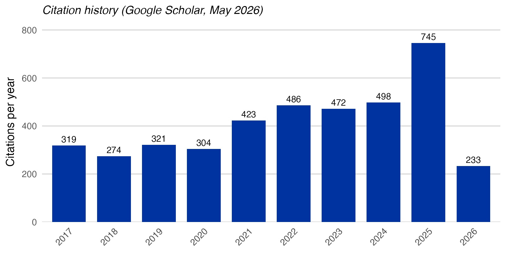
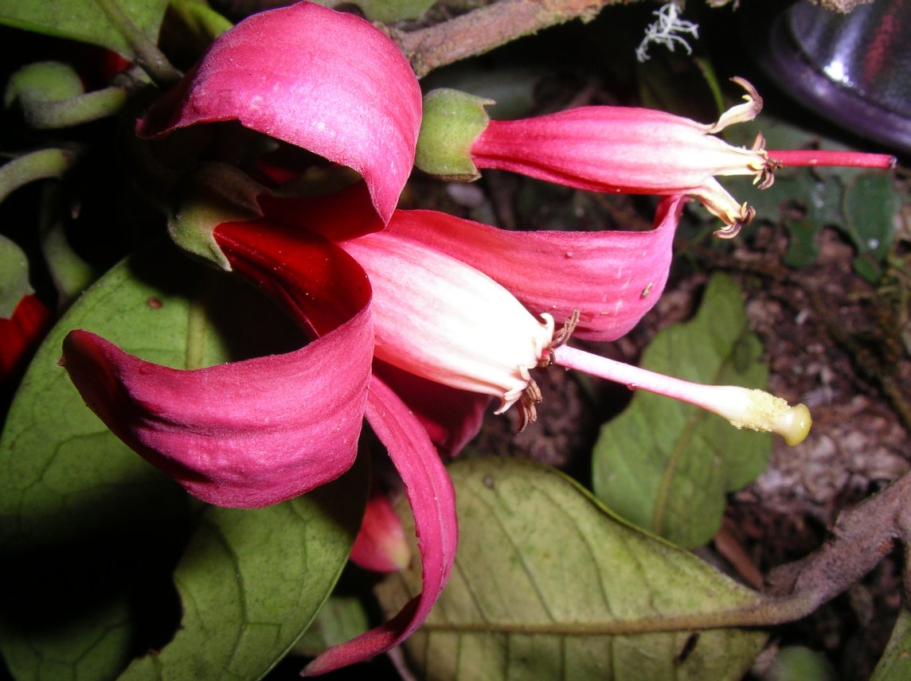

```{r, include=FALSE}
knitr::opts_chunk$set(
  results='asis', 
  echo = FALSE
)


CRANpkg <- function (pkg) {
    cran <- "https://CRAN.R-project.org/package"
    fmt <- "[%s](%s=%s)"
    sprintf(fmt, pkg, cran, pkg)
}

Biocpkg <- function (pkg) {
    sprintf("[%s](http://bioconductor.org/packages/%s)", pkg, pkg)
}

library(glue)
library(tidyverse)

# Set this to true to have links turned into footnotes at the end of the document
PDF_EXPORT <- FALSE

# Holds all the links that were inserted for placement at the end
links <- c()

find_link <- regex("
  \\[   # Grab opening square bracket
  .+?   # Find smallest internal text as possible
  \\]   # Closing square bracket
  \\(   # Opening parenthesis
  .+?   # Link text, again as small as possible
  \\)   # Closing parenthesis
  ",
  comments = TRUE)

sanitize_links <- function(text){
  if(PDF_EXPORT){
    str_extract_all(text, find_link) %>% 
      pluck(1) %>% 
      walk(function(link_from_text){
        title <- link_from_text %>% str_extract('\\[.+\\]') %>% str_remove_all('\\[|\\]') 
        link <- link_from_text %>% str_extract('\\(.+\\)') %>% str_remove_all('\\(|\\)')
        
        # add link to links array
        links <<- c(links, link)
        
        # Build replacement text
        new_text <- glue('{title}<sup>{length(links)}</sup>')
        
        # Replace text
        text <<- text %>% str_replace(fixed(link_from_text), new_text)
      })
  }
  
  text
}


# Takes a single row of dataframe corresponding to a position
# turns it into markdown, and prints the result to console.
build_position_from_df <- function(pos_df){
  
  missing_start <- pos_df$start == 'N/A'
  dates_same <- pos_df$end == pos_df$start
  if (pos_df$end == 9999) {
    pos_df$end = "present"
  }
  if(any(c(missing_start,dates_same))){
    timeline <- pos_df$end
  } else {
    timeline <- glue('{pos_df$end} - {pos_df$start}')
  }

  descriptions <- pos_df[str_detect(names(pos_df), 'description')] %>% 
    as.list() %>% 
    map_chr(sanitize_links)
  
  # Make sure we only keep filled in descriptions
  description_bullets <- paste('-', descriptions[descriptions != 'N/A'], collapse = '\n')
  
  if (length(description_bullets) == 1 && description_bullets == "- ") {
    description_bullets <- ""
  }
  glue(
"### {sanitize_links(pos_df$title)}

{pos_df$loc}

{pos_df$institution}

{timeline}

{description_bullets}


"
  ) %>% print()
}

# Takes nested position data and a given section id 
# and prints all the positions in that section to console
print_section <- function(position_data, section_id){
  x <- position_data %>% 
    filter(section == section_id) %>% 
    pull(data) 
  
  prese <- " - "
  xx <- list()

  for (i in seq_along(x)) {    
      y = x[[i]]
      y <- cbind(y, start2 = as.character(y$start))
      y <- cbind(y, end2 = as.character(y$end))

      se <- paste(y$start, "-", y$end, collapse = " ")
      if (prese == se) {
        y$start2 = ""
        y$end2 = ""
      } else {
        prese = se
      }

    xx[[i]] <- select(y, -c(start, end)) %>%
      rename(start=start2, end=end2)
  }
    
  xx %>% 
    purrr::walk(build_position_from_df)
}


fill_nas <- function(column){
  ifelse(is.na(column), 'N/A', column)
}

# Load csv with position info
position_data <- read_csv('positions.csv') %>% 
  mutate_all(fill_nas) %>% 
  arrange(order, desc(end)) %>% 
  mutate(id = 1:n()) %>% 
  nest(data = c(-id, -section))
```

```{r}
# When in export mode the little dots are unaligned, so fix that. 
if(PDF_EXPORT){
  cat("
  <style>
  :root{
    --decorator-outer-offset-left: -6.5px;
  }
  </style>")
}
```

Aside
================================================================================


{width=100%}

```{r}
# When in export mode the little dots are unaligned, so fix that. 
if(PDF_EXPORT){
  cat("View this CV online with links at _guangchuangyu.github.io/cv_")
}
```

Contact {#contact}
--------------------------------------------------------------------------------


- <i class="fa fa-envelope"></i> [svenbuerki@boisestate.edu](mailto:svenbuerki@boisestate.edu)
- <i class="fa fa-id-card"></i> **ORCID** [0000-0002-8299-6539](https://orcid.org/0000-0002-8299-6539)
- <i class="fa fa-graduation-cap"></i> [Google Scholar](https://scholar.google.com/citations?user=hj0LXQcAAAAJ)
- <i class="fa fa-leaf"></i> **IPNI** [20008578-1](https://www.ipni.org/a/20008578-1)
- <i class="fa fa-github"></i> [svenbuerki](https://github.com/svenbuerki)
- <i class="fa fa-globe"></i> [floraoftheworld.org](https://floraoftheworld.org)

<br>

Skills {#skills}
--------------------------------------------------------------------------------


<i class="fa fa-laptop"></i> **Programming**: R, RMarkdown, LaTeX, bash, HTML, Git, GitHub  <br>
<i class="fa fa-laptop"></i> **R package:** [G2PMineR](https://buerkilabteam.github.io/G2PMineR_Web/)  <br>
<i class="fa fa-flask"></i> **Laboratory**: Next-generation sequencing (WGS, RNAseq), Sanger, PCR, tissue culture  <br>
<i class="fa fa-lightbulb-o"></i> **Other**: GxE experiments, Reproducible Science, Taxonomy <br> 

<br>

Disclaimer {#disclaimer}
--------------------------------------------------------------------------------


Last updated on `r Sys.Date()`.


Main
================================================================================

Sven Buerki, Ph.D. {#title}
--------------------------------------------------------------------------------

<div class="title-subhead">
<p class="chair">Dr.&nbsp;Christopher Davidson Endowed Chair in Botany</p>
<p class="rank">Associate Professor, Department of Biological Sciences</p>
<p class="affil">Boise State University, Boise, Idaho, USA</p>
</div>

<div class="distinction-box">
<div class="distinction-cols">
<div>
<h4>Academic Distinction</h4>
<ul>
<li><strong>Dr. Christopher Davidson Endowed Chair in Botany</strong> (2024–present) — a named, endowed academic chair recognising research excellence in plant sciences at BSU</li>
<li><strong>Scientific Director &amp; Editor, <a href="https://floraoftheworld.org">Flora of the World</a></strong> (2024–present) — international initiative documenting flowering plant diversity in native environments (6,000+ species across 483 families)</li>
<li><strong>Consortium Member &amp; Taxonomic Working Group, <a href="https://www.worldfloraonline.org/">World Flora Online</a></strong> — the international consortium producing the authoritative global checklist of all plant species</li>
<li><strong>Research Associate</strong>, Missouri Botanical Garden (2010–present)</li>
<li><em>Nature</em> co-author (×2; 2020, IF 43.1; 2024, IF 64.8) — international consortia leveraging my expertise in Sapindaceae and Pandanaceae systematics and tropical floras (Madagascar, SE Asia)</li>
</ul>
</div>
<div>
<h4>Research Impact</h4>
<table class="metrics-table">
<tr><td>Total peer-reviewed publications</td><td>137</td></tr>
<tr><td>As first author</td><td>30</td></tr>
<tr><td>As senior (last) author</td><td>45</td></tr>
<tr><td>Publications at BSU (2018–present)</td><td>55</td></tr>
<tr><td>Pubs at BSU with graduate students</td><td>26</td></tr>
<tr><td>Total citations (Google Scholar)</td><td>5,216</td></tr>
<tr><td>H-index</td><td>38</td></tr>
<tr><td>i10-index</td><td>85</td></tr>
</table>
<ul>
<li><strong>First reference genome for sagebrush</strong> (<em>Artemisia tridentata</em>; 4.2 Gbp) — anchors a federally funded conservation genomics program with multiple agency partners</li>
<li><strong>EDGE plants framework</strong> — senior (last) author on <em>Gymnosperms on the EDGE</em> (Forest et al. 2018, <em>Scientific Reports</em>) and co-author on the angiosperm-wide <em>High risk of extinction across the flowering plant tree of life</em> (Forest et al. 2026, <em>Science</em>); two collaborative analyses extending Evolutionarily Distinct &amp; Globally Endangered (EDGE) prioritisation across the plant kingdom and informing global, evolution-informed conservation planning</li>
</ul>
</div>
</div>
</div>

<div class="research-statement">
<h3>Research Statement</h3>

<p>I am an evolutionary biologist whose research advances understanding of the genomic mechanisms underlying plant resilience to global change, including climate change, land-use transformation, and biological invasions. My program integrates evolutionary genomics, conservation biology, and restoration science to develop applied strategies for plant conservation, genetic rescue, and long-term ecosystem resilience. The breadth and impact of this program is reflected in co-authorship of high-profile papers in <em>Nature</em> (<em>New Guinea has the world's richest island flora</em>, 2020, IF 43.1; <em>Phylogenomics and the rise of the angiosperms</em>, 2024, IF 64.8) and <em>Science</em> (<em>High risk of extinction across the flowering plant tree of life</em>, 2026), and in the production of the first reference genome for sagebrush (<em>Artemisia tridentata</em>; 4.2 Gbp), which anchors a federally funded conservation genomics program for a keystone species of the western North American sagebrush steppe.</p>

<p>A defining feature of my research is a team science approach that brings together academic researchers, land managers, conservation practitioners, and other stakeholders to co-produce science addressing urgent conservation challenges. Through shared goals, collaborative problem-solving, and integrated technical frameworks, my lab develops science-based solutions that connect fundamental discovery with practical outcomes for threatened plant species and ecosystems.</p>

<p>Supporting this work, we develop innovative approaches in plant propagation, biobanking, and conservation technology that enable both foundational research and actionable tools for restoration practice. This translational focus positions my research at the interface of genomics, conservation innovation, and applied ecosystem management.</p>

<p>In addition to my work in plant resilience and conservation genomics, I contribute to plant taxonomy, molecular systematics, biogeography, and biodiversity informatics through collaborative initiatives such as <strong><a href="https://floraoftheworld.org">Flora of the World</a></strong> and our partnership with <strong>World Flora Online</strong>. Although spanning different geographic scales and taxonomic contexts, both strands of my research share a common purpose: building the genomic and informatics foundations that enable evidence-based plant conservation at local, regional, and global scales. This work advances international biodiversity data standards, controlled vocabularies, and ontologies to strengthen interoperable knowledge resources that support plant discovery, documentation, and conservation, while contributing to the informatics infrastructure that underpins global plant conservation efforts.</p>
</div>

Education {data-icon=graduation-cap data-concise=true}
--------------------------------------------------------------------------------

```{r, results='asis', echo = FALSE}
print_section(position_data, 'education')
```


Research Experience {data-icon=laptop}
--------------------------------------------------------------------------------

```{r, results='asis', echo = FALSE}
print_section(position_data, 'research_positions')
```

Publications in peer-reviewed journals {data-icon=book}
--------------------------------------------------------------------------------

```{r, results='asis', eval=T, echo=FALSE}
profile = jsonlite::fromJSON("profile.json")
cites = jsonlite::fromJSON("citation.json")
if (profile$total_cites < sum(cites$cites))
  profile$total_cites <- sum(cites$cites)

cat(glue::glue(
'<div class="pub-summary">
<div class="ps-grid">
<div class="ps-stats">
<p><strong>Total peer-reviewed publications:</strong> 137 &nbsp; <strong>First author:</strong> 30 &nbsp; <strong>Senior author:</strong> 45</p>
<p><strong>Citations:</strong> {format(profile$total_cites, big.mark=",")} &nbsp; <strong>H-index:</strong> {profile$h_index} &nbsp; <strong>i10-index:</strong> {profile$i10_index}</p>
<p><strong>International collaborators:</strong> 370+ researchers worldwide, reflecting extensive collaborations across institutions and countries.</p>
<p class="ps-source">Source: Google Scholar, May 2026</p>
</div>
<div class="ps-chart">

</div>
</div>
</div>'
))
```

```{r}
print_section(position_data, 'academic_articles')
```

<div class="novelties-box">
<h4>Plant Taxonomic Novelties</h4>
<p class="novelties-intro">Contributions to the documentation and description of plant biodiversity, with a focus on global biodiversity hotspots (Madagascar, Southeast Asia). Published names span the families <em>Sapindaceae</em>, <em>Pandanaceae</em>, and <em>Rhamnaceae</em>.</p>
<div class="novelties-grid">
<div><span class="n-count">1</span><span class="n-label">Family</span></div>
<div><span class="n-count">6</span><span class="n-label">Tribes</span></div>
<div><span class="n-count">4</span><span class="n-label">Genera</span></div>
<div><span class="n-count">3</span><span class="n-label">Sections</span></div>
<div><span class="n-count">33</span><span class="n-label">Species</span></div>
<div><span class="n-count">1</span><span class="n-label">Replacement name</span></div>
<div><span class="n-count">114</span><span class="n-label">New combinations</span></div>
<div><span class="n-count">162</span><span class="n-label">Total published names</span></div>
</div>
<p class="novelties-ipni"><i class="fa fa-id-badge"></i> Full list at <a href="https://www.ipni.org/a/20008578-1"><strong>IPNI: 20008578-1</strong></a></p>
</div>


Publications in review {data-icon=book}
--------------------------------------------------------------------------------

```{r}
print_section(position_data, 'in_review')
```


Book chapters {data-icon=book}
--------------------------------------------------------------------------------

```{r}
print_section(position_data, 'book_chapters')
```


Other Publications {data-icon=book}
--------------------------------------------------------------------------------


```{r}
print_section(position_data, 'other_pub')
```

Outreach {data-icon=book}
--------------------------------------------------------------------------------

```{r}
print_section(position_data, 'outreach')
```

<div class="inline-box">
<h4>Eponymy</h4>
<div class="ib-cols">
<div class="ib-text">
<p>A species of the family Meliaceae from Madagascar was named in my honour, recognising contributions to the study and conservation of the Malagasy flora:</p>
<p style="text-align:center; margin-top:6pt;"><em><strong>Turraea buerkii</strong></em> Callm., Phillipson &amp; Lowry, <em>Adansonia, s&eacute;r. 3</em>, 34(1): 100. 2012.</p>
</div>
<div class="ib-img"></div>
</div>
</div>


Grants  {data-icon=chart-line}
--------------------------------------------------------------------------------

<div class="section-intro">
<p>My record of extramural funding reflects a sustained and purposeful strategy to build research capacity and partnerships around a central translational goal: producing native seed resources that support species recovery and large-scale habitat restoration. This funding has enabled long-term collaborations with federal agencies&mdash;including the <strong>Bureau of Land Management</strong>, <strong>U.S. Fish and Wildlife Service</strong>, and <strong>Idaho National Guard</strong>&mdash;and BSU colleagues Ian Robertson, Jim Beck, and Marcelo Serpe, supporting a program that integrates genomics, conservation biology, and applied management to address restoration challenges across the Intermountain West.</p>
</div>

```{r}
print_section(position_data, 'grant')
```


Teaching Experience {data-icon=chalkboard-teacher}
--------------------------------------------------------------------------------

<div class="section-intro">
<p>Teaching is a core component of my scholarly leadership, grounded in evidence-based pedagogy and a commitment to empowering students as active learners. I design courses that embed authentic research experiences&mdash;from working with real datasets and open-ended investigations to collaborative, team-based projects&mdash;so that students develop both disciplinary expertise and the professional skills essential for successful scientific careers. By integrating <strong>active learning</strong>, <strong>reproducible workflows</strong>, and research-informed practices into the classroom, I bridge coursework and research, preparing students to contribute meaningfully to science from the outset. Consistent with this philosophy, all of my courses are <strong>open-source and freely available online</strong>, reflecting my commitment to transparency, reproducibility, and open scholarship as foundational principles of both teaching and scientific practice.</p>
</div>

```{r, results='asis', echo = FALSE}
print_section(position_data, 'teaching_positions')
```

Graduate students {data-icon=chalkboard-teacher}
--------------------------------------------------------------------------------

<div class="section-intro">
<p>Graduate mentorship is a defining component of my scholarly leadership. I am committed to developing students as <strong>independent scientists and future research leaders</strong> through sustained guidance in critical thinking, problem-solving, scientific communication, and collaborative scholarship. My mentoring philosophy emphasizes professional formation as well as research training, preparing students to contribute original scholarship, communicate discoveries broadly, and participate meaningfully in interdisciplinary research teams. For doctoral trainees, I make it a priority to bring at least one dissertation chapter to publication, providing experience with the full research and publication process&mdash;from discovery through peer review and dissemination&mdash;while fostering the collaborative practices that underpin successful scientific careers.</p>
</div>

```{r}
print_section(position_data, 'students')
```


Research staff {data-icon=fa-flask}
--------------------------------------------------------------------------------

<div class="section-intro">
<p>My lab is committed to providing meaningful, paid research experiences for undergraduate students. Over the past three years (2023&ndash;present), I have maintained <strong>two paid undergraduate research assistant positions each semester</strong> (10&ndash;20 hours per week), giving students hands-on training in genomics, bioinformatics, and conservation biology alongside graduate students and research staff.</p>
</div>

```{r}
print_section(position_data, 'research_staff')
```

Graduate committees
--------------------------------------------------------------------------------

<div class="section-intro">
<p>Beyond directing my own students, I actively contribute to graduate training across the department by serving on thesis and dissertation committees. Since joining BSU in 2017, I have served on <strong>11 graduate committees</strong> (9 MS, 2 PhD), all of which have now graduated, spanning plant systematics, genomics, ecology, chemical ecology, microbiology, and conservation genomics&mdash;both at BSU and at external institutions. I am currently serving on <strong>5 additional committees</strong> (1 MS Biology, 4 EEB PhD) at BSU.</p>
</div>

```{r}
print_section(position_data, 'graduate_committee')
```

External referee
--------------------------------------------------------------------------------

```{r}
print_section(position_data, 'ext_ref')
```


Conferences, seminars and invited speaker {data-icon=group}
--------------------------------------------------------------------------------

```{r}
print_section(position_data, 'presentation')
```

<div class="inline-box">
<h4>Professional Service &amp; Affiliations</h4>
<ul>
<li><strong>Scientific Director &amp; Editor, <a href="https://floraoftheworld.org">Flora of the World</a></strong> (2024&ndash;present) &mdash; an international initiative documenting the diversity of flowering plant families in their native environments, with a focus on global biodiversity hotspots</li>
<li><strong>Consortium Member &amp; Taxonomic Working Group, <a href="https://www.worldfloraonline.org/">World Flora Online</a></strong> (2026&ndash;present) &mdash; the international consortium producing the authoritative global checklist of all plant species</li>
<li><strong>Research Associate</strong>, Missouri Botanical Garden (2010&ndash;present)</li>
<li><strong>Biobanking Consultant</strong>, Revive &amp; Restore (Genetic Rescue of Endangered and Extinct Species, 2023&ndash;present)</li>
<li><strong>Expert Panel Member, <em>Lepidium papilliferum</em> (LEPA) Recovery Tech Team</strong> (2024&ndash;present) &mdash; an interdisciplinary panel of academic researchers and federal agency scientists convened to guide recovery efforts for the slickspot peppergrass (<em>Lepidium papilliferum</em>), a federally threatened species endemic to southwestern Idaho; the team meets annually to review progress and provide science-based recommendations informing the species recovery plan</li>
<li><strong>Associate Editor</strong>, <em>Plants</em> (MDPI, 2022&ndash;present) and <em>Candollea</em> (2016&ndash;present)</li>
<li><strong>Member</strong>, Botanical Society of America</li>
<li><strong>Faculty member</strong>, Ecology, Evolution &amp; Behavior PhD Program and Biomolecular Sciences Graduate PhD Program, BSU</li>
<li><strong>Graduate Program Steering Committee</strong>, Department of Biological Sciences, BSU: MS in Biology (2018&ndash;2024), MS in Raptor Biology (2018&ndash;2024), and Ecology, Evolution &amp; Behavior PhD Program (2024&ndash;present)</li>
<li><strong>Co-lead</strong>, NSF EPSCoR GEM3 Sagebrush Mechanism Team</li>
<li><strong>Member, Collections Committee</strong>, Idaho Botanical Garden (2026&ndash;present) &mdash; charged with establishing a collections policy for the garden, subject to five-year review cycles</li>
</ul>
</div>

Organization of symposia {data-icon=group}
--------------------------------------------------------------------------------

```{r}
print_section(position_data, 'symposia_organization')
```

Posters {data-icon=group}
--------------------------------------------------------------------------------

```{r}
print_section(position_data, 'posters')
```

```{r}
if(PDF_EXPORT){
  cat("

Links {data-icon=link}
--------------------------------------------------------------------------------


")

  walk2(links, 1:length(links), function(link, index){
    print(glue('{index}. {link}'))
  })
}
```

<script>
/* Fixup: pagedown's bundled JS reshapes every .level3 into a date/decorator/details
   flex layout and absorbs trailing siblings into the details column. Custom boxes
   placed at the end of a section (.inline-box, .novelties-box) get swept into the
   last entry's details column, which corrupts the layout of the rest of the page.
   This script runs after pagedown's reshape and moves each such box out of the
   level3 it was absorbed into, re-appending it to its section (.level2) so it
   sits cleanly at the end of the section without disturbing the timeline. */
document.addEventListener('DOMContentLoaded', function() {
  setTimeout(function() {
    document.querySelectorAll('.inline-box, .novelties-box').forEach(function(box) {
      var level3 = box.closest('.level3');
      if (!level3) return;
      var level2 = level3.closest('.level2');
      if (!level2) return;
      level2.appendChild(box);
    });
  }, 0);
});
</script>


