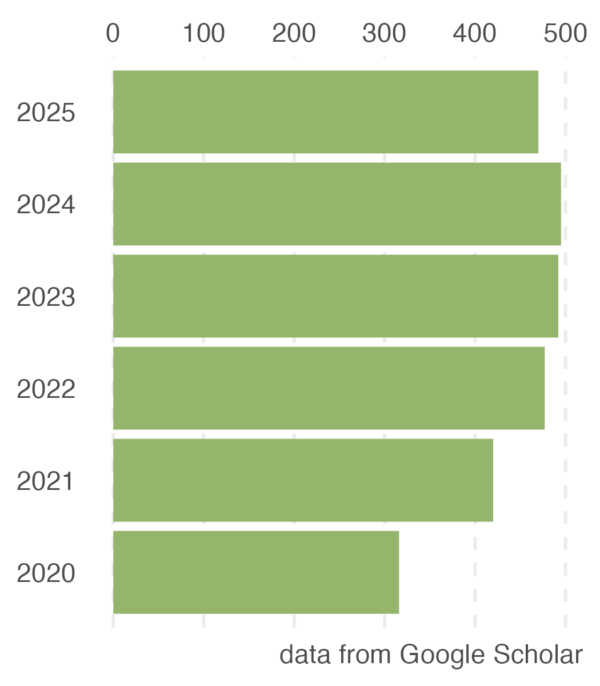

```{r, include=FALSE}
knitr::opts_chunk$set(
  results='asis', 
  echo = FALSE
)


CRANpkg <- function (pkg) {
    cran <- "https://CRAN.R-project.org/package"
    fmt <- "[%s](%s=%s)"
    sprintf(fmt, pkg, cran, pkg)
}

Biocpkg <- function (pkg) {
    sprintf("[%s](http://bioconductor.org/packages/%s)", pkg, pkg)
}

library(glue)
library(tidyverse)

# Set this to true to have links turned into footnotes at the end of the document
PDF_EXPORT <- FALSE

# Holds all the links that were inserted for placement at the end
links <- c()

find_link <- regex("
  \\[   # Grab opening square bracket
  .+?   # Find smallest internal text as possible
  \\]   # Closing square bracket
  \\(   # Opening parenthesis
  .+?   # Link text, again as small as possible
  \\)   # Closing parenthesis
  ",
  comments = TRUE)

sanitize_links <- function(text){
  if(PDF_EXPORT){
    str_extract_all(text, find_link) %>% 
      pluck(1) %>% 
      walk(function(link_from_text){
        title <- link_from_text %>% str_extract('\\[.+\\]') %>% str_remove_all('\\[|\\]') 
        link <- link_from_text %>% str_extract('\\(.+\\)') %>% str_remove_all('\\(|\\)')
        
        # add link to links array
        links <<- c(links, link)
        
        # Build replacement text
        new_text <- glue('{title}<sup>{length(links)}</sup>')
        
        # Replace text
        text <<- text %>% str_replace(fixed(link_from_text), new_text)
      })
  }
  
  text
}


# Takes a single row of dataframe corresponding to a position
# turns it into markdown, and prints the result to console.
build_position_from_df <- function(pos_df){
  
  missing_start <- pos_df$start == 'N/A'
  dates_same <- pos_df$end == pos_df$start
  if (pos_df$end == 9999) {
    pos_df$end = "present"
  }
  if(any(c(missing_start,dates_same))){
    timeline <- pos_df$end
  } else {
    timeline <- glue('{pos_df$end} - {pos_df$start}')
  }

  descriptions <- pos_df[str_detect(names(pos_df), 'description')] %>% 
    as.list() %>% 
    map_chr(sanitize_links)
  
  # Make sure we only keep filled in descriptions
  description_bullets <- paste('-', descriptions[descriptions != 'N/A'], collapse = '\n')
  
  if (length(description_bullets) == 1 && description_bullets == "- ") {
    description_bullets <- ""
  }
  glue(
"### {sanitize_links(pos_df$title)}

{pos_df$loc}

{pos_df$institution}

{timeline}

{description_bullets}


"
  ) %>% print()
}

# Takes nested position data and a given section id 
# and prints all the positions in that section to console
print_section <- function(position_data, section_id){
  x <- position_data %>% 
    filter(section == section_id) %>% 
    pull(data) 
  
  prese <- " - "
  xx <- list()

  for (i in seq_along(x)) {    
      y = x[[i]]
      y <- cbind(y, start2 = as.character(y$start))
      y <- cbind(y, end2 = as.character(y$end))

      se <- paste(y$start, "-", y$end, collapse = " ")
      if (prese == se) {
        y$start2 = ""
        y$end2 = ""
      } else {
        prese = se
      }

    xx[[i]] <- select(y, -c(start, end)) %>%
      rename(start=start2, end=end2)
  }
    
  xx %>% 
    purrr::walk(build_position_from_df)
}


fill_nas <- function(column){
  ifelse(is.na(column), 'N/A', column)
}

# Load csv with position info
position_data <- read_csv('positions.csv') %>% 
  mutate_all(fill_nas) %>% 
  arrange(order, desc(end)) %>% 
  mutate(id = 1:n()) %>% 
  nest(data = c(-id, -section))
```

```{r}
# When in export mode the little dots are unaligned, so fix that. 
if(PDF_EXPORT){
  cat("
  <style>
  :root{
    --decorator-outer-offset-left: -6.5px;
  }
  </style>")
}
```


Aside
================================================================================


{width=100%}

```{r}
# When in export mode the little dots are unaligned, so fix that. 
if(PDF_EXPORT){
  #cat("View this CV online with links at _guangchuangyu.github.io/cv_")
}
```

Contact {#contact}
--------------------------------------------------------------------------------


- <i class="fa fa-envelope"></i> svenbuerki@boisestate.edu
- <i class="fa fa-github"></i> [svenbuerki](https://github.com/svenbuerki)
- **ORCID** [0000-0002-8299-6539](http://orcid.org/0000-0002-8299-6539)
- <i class="fa fa-phone"></i> +1 208-426-1146


Disclaimer {#disclaimer}
--------------------------------------------------------------------------------


Last updated on `r Sys.Date()`.


Main
================================================================================

Sven Buerki {#title}
--------------------------------------------------------------------------------


```{r, results='asis'}
intro_text <- glue("Assistant Professor, Department of Biological Sciences at Boise State University.")

cat(sanitize_links(intro_text))
```

My lab applies a genome-to-phenome approach to investigate mechanisms of drought adaptations in natural ecosystems. We are currently focusing our efforts on the sagebrush steppe of western North America by using *Artemisia tridentata* as model organism. This research is integrated into the [EPSCoR NSF GEM3](https://www.idahogem3.org) project. 

I am broadly interested in bioinformatics, genomics, molecular evolution and reproducible science.


Research Experience {data-icon=laptop}
--------------------------------------------------------------------------------

```{r, results='asis', echo = FALSE}
print_section(position_data, 'research_positions')
```

\pagebreak

Education {data-icon=graduation-cap data-concise=true}
--------------------------------------------------------------------------------


```{r, results='asis', echo = FALSE}
print_section(position_data, 'education')
```

:::aside
### Skills 

- <i class="fa fa-laptop"></i> **Programming**: R, RMarkdown, LaTeX, bash, HTML, GitHub
- <i class="fa fa-flask"></i> **Laboratory**: NGS, Sanger, PCR, tissue culture
- <i class="fa fa-lightbulb-o"></i> **Other**: GxE experiments, Reproducible Science

:::

Teaching Experience {data-icon=chalkboard-teacher}
--------------------------------------------------------------------------------


```{r}
print_section(position_data, 'teaching_positions')
```


Grants  {data-icon=chart-line}
--------------------------------------------------------------------------------

```{r}
print_section(position_data, 'grant')
```

\pagebreak

Graduate students {data-icon=chalkboard-teacher}
--------------------------------------------------------------------------------

```{r}
print_section(position_data, 'students')
```

:::aside
### Fieldwork experience {data-icon=binoculars}

- **Botanical expeditions**: Croatia, Fiji, Italy, Madagascar, Malaysia (Borneo and Peninsular Malaysia), Mauritius, New Caledonia, Singapore, Switzerland and USA. 
:::

Research staff {data-icon=fa-flask}
--------------------------------------------------------------------------------

```{r}
print_section(position_data, 'research_staff')
```

Graduate committees
--------------------------------------------------------------------------------

```{r}
print_section(position_data, 'graduate_committee')
```

External referee
--------------------------------------------------------------------------------

```{r}
print_section(position_data, 'ext_ref')
```

:::aside

### Scholar metrics

I have authored 101 Web of Knowledge papers (among which 28 as first and 29 as senior author) with 213 co-authors based in 37 countries, demonstrating my international recognition and my ability to collaborate with other scientists in a wide range of fields.

```{r}
profile = jsonlite::fromJSON("profile.json")

  glue(

"
+ Citation = {profile$total_cites}
+ H-index = {profile$h_index}
+ I10-index = {profile$i10_index}

"
  ) %>% print()

```


:::

\pagebreak

Publications in peer-reviewed journals {data-icon=book}
--------------------------------------------------------------------------------

```{r}
print_section(position_data, 'academic_articles')
```

Publications in review {data-icon=book}
--------------------------------------------------------------------------------

```{r}
print_section(position_data, 'in_review')
```

:::aside
### Taxonomic novelties

- I have been working on the molecular systematics of flowering plants, especially Sapindaceae and Pandanaceae. Throughout this work, I had the opportunity to contribute:
  + **Newly described taxa**: 1 family, 4 genera, 3 sections, and 33 species.
  + **New names**: 1 species.
  + **New combinations**: 114 species, and 1 subspecies.
:::

Books {data-icon=book}
--------------------------------------------------------------------------------

```{r}
print_section(position_data, 'book_chapters')
```

\pagebreak

Other Publications {data-icon=book}
--------------------------------------------------------------------------------

```{r}
print_section(position_data, 'other_pub')
```


Conferences, seminars and invited speaker {data-icon=group}
--------------------------------------------------------------------------------

```{r}
print_section(position_data, 'presentation')
```

:::aside
### Eponymy

- In 2005, I was fortunate to be part of a botanical expedition in the Ambohimirahavavy region (Madagascar) where I collected a specimen of Meliaceae, which turned out to represent a new species. My friends were very kind and dedicated this new species to me: _**Turraea buerkii**_ Callm., Phillipson & Lowry, *Adansonia*, *sér.* 3, 34(1): 100. 2012.
{width=100%}
:::

Organisation of symposia {data-icon=group}
--------------------------------------------------------------------------------

```{r}
print_section(position_data, 'symposia_organization')
```

\pagebreak

Posters {data-icon=group}
--------------------------------------------------------------------------------

```{r}
print_section(position_data, 'posters')
```

```{r}
if(PDF_EXPORT){
  cat("
  
Links {data-icon=link}
--------------------------------------------------------------------------------


")
  
  purrr::walk2(links, 1:length(links), function(link, index){
    print(glue('{index}. {link}'))
  })
}
```

